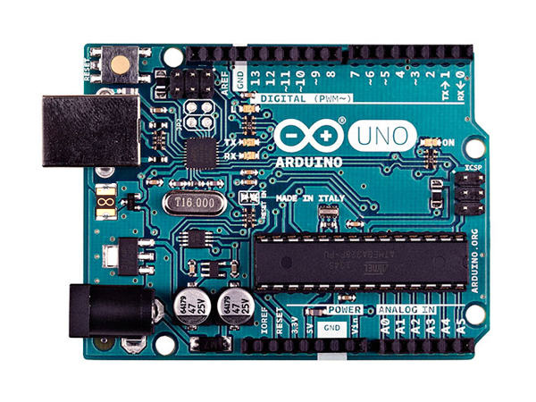

# Fox Hunt Info for Offensive Summit and B-Sides Knoxville 2017

The RF capabilities of your Offensive Summit and B-Sides Knoxville
badges can be used to participate in this year's fox hunt
activities.  Here you'll find information about this year's fox hunt
transmitters and receivers as well as source code you can modify make
your badge extra fancy.

## Events

### BSides Knoxville 2017

* When: May 5, 2017 0900 EST -- 1700 EST
* Frequency: 433.920 MHz
* Where: Market Square, Knoxville, Tennessee
* Point of Contact: In case of problems, interference, etc. contact

    Matthew Van Gundy, KI6KTE  
    Monitoring Frequency: 146.565 MHz

#### Submitting Foxes

Text your name, the fox id, and the fox passcode via
[Signal](https://whispersystems.org/).


### Offensive Summit 2017

* When: May 2, 2017 0900 EST -- May 4, 2017 1700 EST
* Frequency: 433.920 MHz
* Where: West Knoxville, Tennessee
* Point of Contact: In case of problems, interference, etc. contact

    Matthew Van Gundy, KI6KTE  

## The Badges


### Programming



* [Programming the ATtiny with an Arduino](badge/projects/programming_attiny85_with_arduino.md)


* [Programming the ATtiny with a Tiny AVR Programmer](badge/projects/programming_attiny85_with_tiny_avr_programmer.md)

### Badge Documentation

* [Schematic](badge/badge-design/OS-RF-Badge-2017-SCHEMATIC.PDF)
 
* [Attiny85-20pu](http://ww1.microchip.com/downloads/en/DeviceDoc/Atmel-2586-AVR-8-bit-Microcontroller-ATtiny25-ATtiny45-ATtiny85_Datasheet.pdf)

* [mx-fs-03v mx-05v](http://forum.hobbycomponents.com/viewtopic.php?f=25&t=1324)

* [rfm69hcw](https://cdn-shop.adafruit.com/product-files/3076/RFM69HCW-V1.1.pdf) ([adafruit](https://www.adafruit.com/product/3070))

* [Arduino Docs](https://www.arduino.cc/en/Reference/HomePage)


## The Code

First, check out the repo:

```sh
git clone https://github.com/singlethink/os2017-bsides-fox-hunt
git submodule init
git submodule update
```

* [Hound](Arduino/os2017-hound) (simple fox receiver)

* [Fox](Arduino/os2017-fox) (transmitter)


## Protocol

Each fox identifies itself by transmitting messages on 433.920 MHz
according to the following schedule:

1. 30 data packets
2. CW ID @ 10 WPM
3. 30 seconds of silence
4. Goto 1

Badge receivers can only receive the initial 30 data packets.  So,
after 30-ish seconds, each fox will go silent for approximately 1-1.5
minutes while ID-ing and waiting for the start of its next transmit
period.

Data packets are encoded and transmitted via simple On-Off Keying
using
[Virtual Wire](http://www.airspayce.com/mikem/arduino/VirtualWire/).
There are multiple packet formats, including:

```c
struct IdMsg {
    byte foxId;       // unique id of the fox
    uint32_t seq;     // monotonically incrementing sequence number
    byte tag = 0;
    char to_call[9];
    char from_call[9];
};

struct BeaconMsg {
    byte foxId;
    uint32_t seq;
    byte tag = 1;
};
```

For more information, see [PikoFox.h](Arduino/libraries/PikoFox/PikoFox.h).

## Brought to you by

* Matthew Van Gundy, KI6KTE
* Jared Pendleton, KK4DNV
* Everett Stiles
* Jed Eaton
* And many molten lead wielding volunteers
