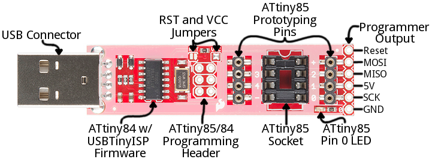

# Offensive Summit '17 Badge Projects

## Programming

* [Programming the ATtiny with an Arduino](projects/programming_attiny85_with_arduino.md)

* [Programming the ATtiny with a Tiny AVR Programmer](projects/programming_attiny85_with_tiny_avr_programmer.md)

## Badge Documentation

* [Schematic](badge-design/OS-RF-Badge-2017-SCHEMATIC.PDF)
 
* [Attiny85-20pu](http://ww1.microchip.com/downloads/en/DeviceDoc/Atmel-2586-AVR-8-bit-Microcontroller-ATtiny25-ATtiny45-ATtiny85_Datasheet.pdf)

* [mx-fs-03v mx-05v](http://forum.hobbycomponents.com/viewtopic.php?f=25&t=1324)

* [rfm69hcw](https://cdn-shop.adafruit.com/product-files/3076/RFM69HCW-V1.1.pdf) ([adafruit](https://www.adafruit.com/product/3070))

* [Arduino Docs](https://www.arduino.cc/en/Reference/HomePage)

